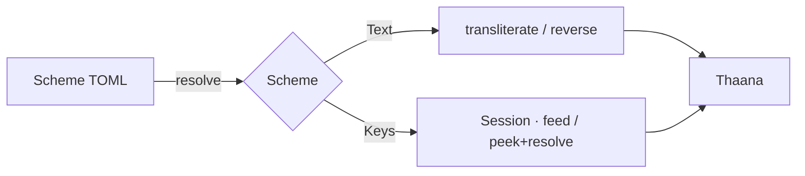
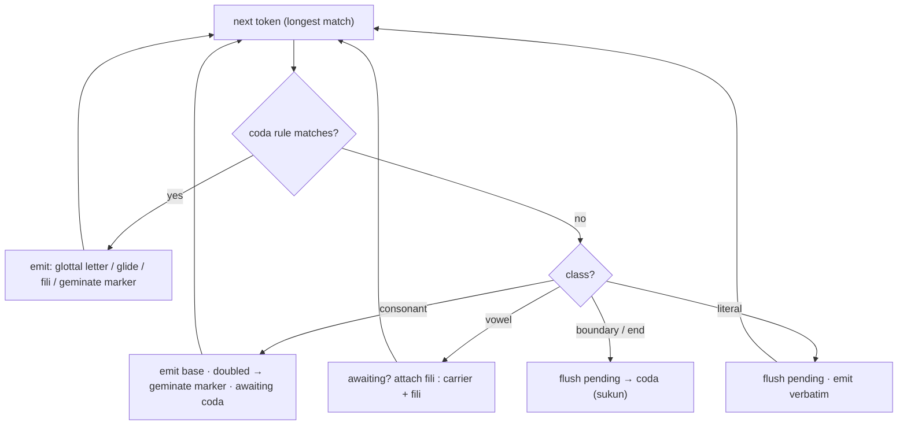
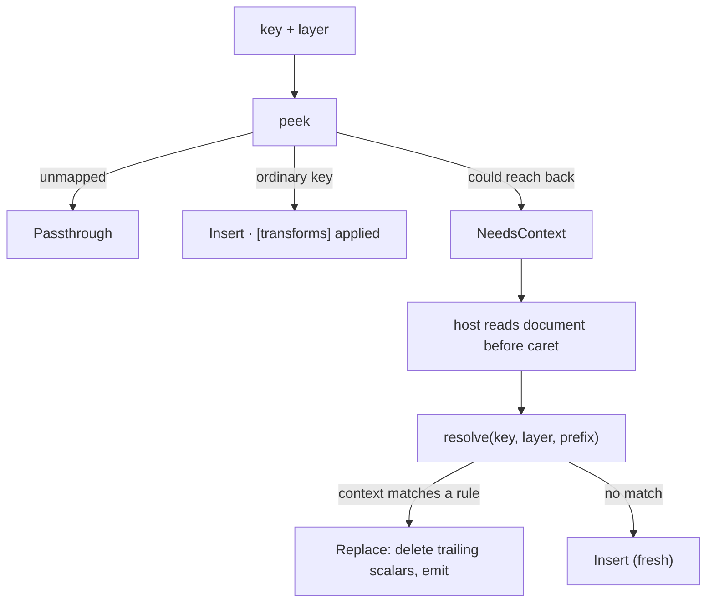

The engine is deliberately small. Two paths share one model: a one-shot **text** path (romanization)
and a stateful **keys** path (live keyboard input).



## The scheme is a sum type

On disk a scheme is a flat TOML record (`RawScheme`). On load it is **resolved** into a typed
[`Scheme`](scheme-format.md) — either `Keys` or `Text`. The inert sections of the other kind simply
don't exist on the resolved value, so illegal states (a scheme with both `[layers]` and `[abugida]`)
are unrepresentable rather than validated-away. `base` inheritance is merged *before* resolution, so a
shared fragment like `thaana-common` may legally carry fields for both kinds.

## Custom schemes — the runtime twin

Beyond the embedded set, a host may **register schemes at runtime** (`register_scheme(id, toml)`). A
registered scheme is the *runtime twin* of a bundled one: the **same TOML format**, resolved through the
**same path** (optional `base` → resolve) — there is no separate format for "custom" schemes. Its `base`
may name a bundled scheme (the customizer's case — a sparse diff over `phonetic`, only the changed keys)
or be absent (a third-party standalone layout). Once registered, the id works everywhere a bundled id
does: listing, sessions, key output.

The registry is **process-global and ephemeral** — the engine still reads no files and persists nothing.
The **host owns persistence and re-hydration**: it loads its own store and feeds the TOML strings back in
on every process start, so a reaped-and-respawned input method re-registers *before* it serves input.
Registration is collision-checked — an id that shadows a built-in, or one already registered, is rejected
with a clear error (the host owns namespacing).

## The abugida composer (text path)

`transliterate` runs a fixed processor over a longest-match token stream. At each position it first
tries the ordered **coda rules** (context-sensitive orthography — see below); if none fire it does a
flat **abugida dispatch**, handing each token to a `Composer` that owns the composition state.

1. **coda rule** — a rule whose `pre { tok } suf` context matches → emit per the rule (a glottal
   letter, a glide, a fili, or the geminate marker); see *Coda orthography* below.
2. **consonant** → emit its base (a doubled consonant → geminate marker); mark *awaiting coda*.
3. **vowel after a consonant** → attach its fili; **vowel at a boundary** → `vowel_carrier` + fili.
4. **boundary / end while awaiting** → the pending consonant takes `default_coda` (sukun).

```text
b a s   →   ބ  ބަ  ބަސް        (s takes a sukun at the boundary)
```

The processor references abstract **roles** (`carrier`, `coda`, `geminate`) from the scheme, never
hardcoded Thaana literals — so it ports to other abugidas without a rewrite.



## Coda orthography: rules, not a lexicon

Coda orthography is an **ordered, first-match-wins list of `pre { tok } suf > emit` context rules** in
the `[coda]` table — kept separate from the universal `[abugida]` roles, and corpus-derived rather than
hand-asserted. One uniform shape covers the word-final glottal, the glide, word-final `y`, and the
medial-`h` marker (see the [scheme format](scheme-format.md#coda-coda-orthography-context-rules) for the
syntax). The load-bearing rules:

**Word-final glottal.** Only five letters take a word-final sukun (`އ ށ ތ ނ ސ`), so a romanized
word-final glottal must be one of `ށ` / `ތ` / `އ` — which one is ambiguous in the grammar (see [Fritz
and the practical write-ups](references.md#language-encoding)), but **deterministic from the preceding
vowel**, a pattern mined from ~290k human transliterations (≈90% per bucket):

| preceding vowel | glottal letter | example |
|---|---|---|
| `a` · `o` · `u` | **shaviyani** `ށ` | `rah → ރަށް` |
| `e` · `ey` | **alifu** `އ` (the indefinite `-eh`) | `ekeh → އެކެއް` |
| `i` · `ee` | **thaa** `ތ` | `hih → ހިތް` |

**Word-final glide** — `iy → ތ` (red `raiy → ރަތް`), leaving the bare diphthong `-ai` alone (a real
vowel 90% of the time). **Word-final `y`** on a pending consonant → eebeefili (native verb endings,
`dheny → ދެނީ`). **Medial `h`** before a consonant → the geminate marker `އް` (`huhdha → ހުއްދަ`,
`mahsala → މައްސަލަ`) — how humans actually write gemination (~67% of medial-`h`, vs ~1% literal `ހް`);
a more-specific rule keeps the `koh`-family stem-glottal correct (`o { h } consonant → ށ`, so
`kohfi → ކޮށްފި`).

Together these reach **≈56% word-level exact match** (per-occurrence) against the 290k-pair human
corpus — deterministically, with no shipped data.

:::note[What's *not* chased]
The residual is genuinely lexical/morphological — lexicalised stem changes (`mas → maheh`), loanword
spellings, and morpheme-boundary cases a rule can't see (`a + h` compounds like `rahthah`, Arabic
names like `mahloof`). That's left to a consumer-side radheef pass — the engine stays small and
deterministic. The Malé Latin standard itself concedes this ceiling (the "disappeared" letter only
returns "when the word is joined or used in full").
:::

## Rewrites — an optional post-correction layer (FST-inspired)

A `text` scheme may carry an optional **`[rewrites]`** block: an ordered list of context-rewrites applied
to the **composed Thaana** (after the abugida + coda pass, so *rule-first → rewrites*). Each rule does one
left-to-right pass, replacing `match` with `out` where its `pre`/`post` context holds. Unlike the rest of
a scheme these are **not** hand-curated — they are **data-mined and net-scored** by an offline pipeline:
candidate corrections come from the corpus, and a rule survives only when it is *net-positive across the
whole training set* (fixes − breaks).

The bundled **`male-latin-corpus`** is `base = "male-latin"` + such a block (99 rules), **+4.14 pts
word-exact on a held-out split** over the hand-curated baseline — *generalising*, so it stays
**lexicon-free**. It's the corpus-tuned sibling of the principled `male-latin`.

:::note[Why 'FST-inspired', not 'an FST']
A list of context-rewrites is *compile-equivalent* to a finite-state transducer (foma/ICU compile
one; cvutils ships exactly this choice — a longest-match table or a foma FST). The engine runs the
**rewrite cascade directly** rather than compiling to a state machine — simpler, debuggable,
dependency-free, and authorable as plain data. So the honest name is `rewrites`.
:::

## Reverse

For a reversible `text` scheme, `reverse` inverts the maps and is **glottal-aware**: a word-final
`ށް` / `ތް` reads back as the glottal romanisation (`ރަށް → "rah"`), not the bare consonant. Because
the forward `[coda]` rules are many-to-one, reverse is lossy on word-final glottals — it picks one
reading. Everything else round-trips.

## The keys path

A `Session` drives a keyboard layout key-by-key. There are **two ways to call it**, depending on what the
host can do:

**Stateful — `feed` / `backspace` / `output`.** Keeps a committed-unit history. `feed` maps the key 1:1
through the active modifier layer, applies the enabled `[transforms]` (substitute, smart-quotes), and runs
optional toggleable **sequence rules** (the canonical one being `aa → aabaafili`) against the typed
history; `backspace` retracts a whole composed unit. Used by the wasm playground, Python,
and the CLI.

**Context-aware — `peek` / `resolve` — what the macOS IME uses.** Bufferless: it never trusts an internal
history (which would go stale the moment the user clicks mid-word) and reads the live document instead.
`peek` resolves an ordinary key inline (`Insert` / `Passthrough`); for a key that *could* reach back it
returns `NeedsContext`. The host then reads the Thaana before the caret and calls `resolve(key, layer,
prefix)`, which matches the reach-back rules against that **real context** — so the `aa → ާ` double-tap
fires on the fili actually in the document, however the caret got there. Backspace is the system's
(per-codepoint), not the engine's. This is Keyman's `set_context_if_needed`, shrunk to one unit and pulled
lazily per key — the costly context read happens only on a reach-back key, never on the ordinary stream.



## Design notes

- **Longest-match tokenizing.** The text path scans the input for the longest token that matches a
  scheme entry, so digraphs win over single letters (`dh` before `d`) without ordering hacks.
- **Roles, not literals — so it ports.** Because the composer references abstract roles rather than
  Thaana codepoints, the same processor drives any abugida that fills those roles. Thaana populates the
  subset it needs; another Brahmic script would supply its own carrier, coda, and gemination marker.
- **No I/O — schemes embedded or host-fed.** The engine reads no files. The default schemes are compiled
  in; custom ones are *registered* by the host (which owns any I/O) into an ephemeral runtime registry —
  see [Custom schemes](#custom-schemes-the-runtime-twin). Either way the engine touches no filesystem,
  which is what lets it drop cleanly into a sandboxed input method, a wasm page, or an embedded device,
  and keeps the [bindings](bindings.md) pure marshalling.
- **Reverse is a separate, stable reading.** Reverse isn't the exact inverse of forward (the word-final
  rules are many-to-one). It's a deterministic Thaana→Latin reading — useful for search and export —
  and schemes whose forward map loses information are flagged `lossy`.
