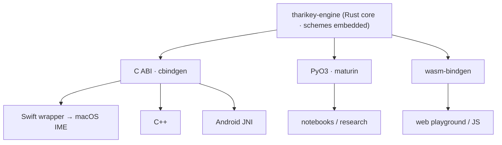

The core is owned and I/O-free, so the bindings are thin marshalling layers — never a reimplementation.
Each exposes the **same full surface**: `transliterate` / `reverse`, scheme metadata + options + per-key
output, the runtime custom-scheme registry, and a stateful `Session` (including the context-aware
`peek` / `resolve` reach-back).



| Binding | Tooling | For |
|---------|---------|-----|
| **C ABI** (`tharikey-c`) | `extern "C"` + cbindgen | The native substrate — Swift (macOS IME), C++, Android JNI |
| **Python** (`tharikey-py`) | PyO3 / maturin | Data pipeline, notebooks, research |
| **wasm** (`tharikey-wasm`) | wasm-bindgen | The web playground, JS/TS |

## C ABI — the native substrate

A hand-written, flat C interface generated to `tharikey.h` by cbindgen. Swift, C++, and Android JNI all
consume the **same** ABI, so Android reuses it (a thin JNI shim) rather than re-implementing.

```c
#include "tharikey.h"

char *out = tk_transliterate("male-latin", "rah");   // → "ރަށް" (caller-owned)
tk_string_free(out);

TkSession *s = tk_session_new("phonetic");
TkResponse r = tk_session_feed(s, "b", "base");   // r.action: 0 passthrough · 1 insert · 2 replace
tk_string_free(r.text);                           // r.text is owned (insert/replace), null otherwise
tk_session_free(s);
```

For live keyboard input the stateful `tk_session_feed` above drives a committed buffer (with
`tk_session_backspace`). The macOS IME instead uses the **bufferless context handshake** — `tk_session_peek`
returns `action: 3` (*needs context*) when a key could reach back, and `tk_session_resolve(s, key, layer,
prefix)` matches the document text before the caret (see [the keys path](architecture.md#the-keys-path)).

:::note[Memory contract]
Every `char*` returned is **caller-owned** — free it with `tk_string_free`. Every `TkSession*` is
freed with `tk_session_free`. All functions are null-safe. The one exception: `tk_version()` returns a
**static** engine-version string — do **not** free it.
:::

### Swift

A thin `Tharikey.swift` wrapper over the C header gives the macOS app an ergonomic surface — raw C
pointers never escape it:

```swift
Tharikey.transliterate("male-latin", "rah")     // "ރަށް"

let s = TharikeySession("phonetic")
let r = s?.feed(key: "b", layer: "base")         // KeyResponse: .insert("ބ")  (or .passthrough / .replace)
```

<details>
<summary>Why a C ABI?</summary>

A C ABI is the universal native substrate — Swift, C++, and Android JNI all speak it, so one
interface serves them all with no per-language codegen. It's lean, has a stable inspectable header,
and keeps the throughput paths (bulk transliterate, dictionary search) fast.

</details>

### Custom schemes

A host can register schemes at runtime — the
[runtime twin](architecture.md#custom-schemes-the-runtime-twin) of the embedded set, same TOML format:

```c
char *err = tk_scheme_register("my-layout", toml);   // null = ok; else an owned error string
if (err) { /* collision / invalid TOML */ tk_string_free(err); }
// "my-layout" now works like any bundled id (tk_session_new, tk_scheme_id_at, key output, …)
tk_scheme_unregister("my-layout");
```

The engine does **not** author schemes — it only resolves and reports. The **host builds the scheme
TOML** itself (the same format as bundled; for the customizer, a sparse `base`-inheriting diff that
overrides only the changed keys), then registers it. The macOS app, for example, serializes its editor
model to TOML with TOMLKit. There is deliberately no engine-side authoring sugar.

In Swift: `Tharikey.registerScheme(_:toml:)` (throwing), `unregisterScheme`, `clearCustomSchemes`,
`isCustom`; `Tharikey.schemes()` includes registered schemes automatically. The host owns the store and
re-registers on each start — see [Custom schemes](architecture.md#custom-schemes-the-runtime-twin).

## Python

```python
import tharikey
tharikey.transliterate("male-latin", "raajje")   # 'ރާއްޖެ'
```

Built with maturin; used for the corpus work behind the engine's
[glottal rules](architecture.md).

## wasm

Published to npm as **`@tharikey/engine`** (built with `wasm-pack`, bundler target). Powers this site's
playground.

## Installing

Rust and Python build from source (Rust toolchain required); JavaScript installs the published package:

```toml
# Rust — Cargo.toml
tharikey-core = { git = "https://github.com/tharikey/tharikey-engine", package = "tharikey-core" }
```

```sh
# Python — needs a Rust toolchain (maturin builds from source)
pip install "git+https://github.com/tharikey/tharikey-engine.git#subdirectory=bindings/python"
```

```sh
# JavaScript / TypeScript — published to npm, no build needed
npm install @tharikey/engine
```

### Distribution channels

| Artifact | Channel |
|----------|---------|
| Rust `tharikey-core` | git dependency · crates.io *(planned)* |
| Python `tharikey-py` | git · PyPI wheel *(planned)* |
| wasm `tharikey-wasm` | npm — `@tharikey/engine` |
| C ABI `tharikey-c` | GitHub Release assets — header + universal lib + `.xcframework` (+ SwiftPM `binaryTarget`) |
| Android | Maven Central — a JNI `.aar` over the C ABI *(planned)* |

Releases share one engine version, driven by a git tag.
