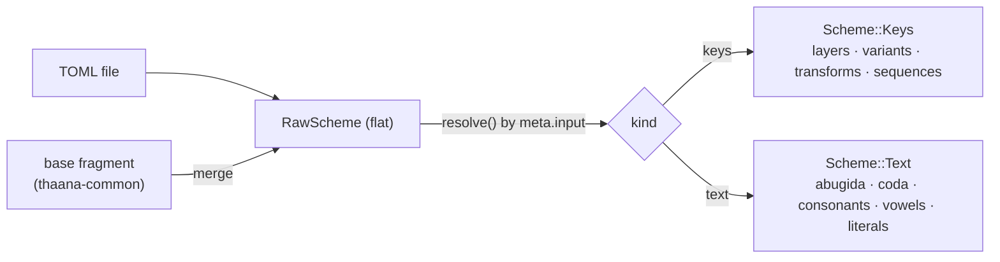

A scheme is a single TOML file. It is **our own format** — not an interop target — chosen to be
human-authorable and comment-friendly. Two input kinds share one model.

## Metadata

```toml
[meta]
id          = "male-latin"      # stable, unique slug
name        = "Malé Latin"
description  = "Type Dhivehi in the everyday 1976 romanization."   # short blurb (scheme cards)
about        = "The official 1976 Malé Latin romanization … "      # long "about" + attribution (detail page)
base        = "thaana-common"   # optional: inherit shared defaults, then override
input       = "text"            # "keys" | "text"
reversible  = true              # text schemes that round-trip
lossy       = true              # reverse can't perfectly restore input
reverse_exclude = ["c"]         # forward-only input aliases (optional) — see below
```

`description` (short) and `about` (long — the place for **attribution**: the source layout + license) are
host-surfaced display text. Both optional; exposed via `tk_scheme_description` / `tk_scheme_about`.

Conventions shared across schemes (RTL punctuation, smart-quote glyphs, bracket flip, the rufiyaa
substitution) live once in the `thaana-common` base; a scheme sets `base = "thaana-common"` and inherits
them. The merge follows three explicit policies by field:

- **Replace** (child wins outright) — `meta`, and the optional `[abugida]` / `[coda]` blocks (replaced
  only when the child sets them).
- **Union** (maps merge, child key wins) — `[layers.*]`, `[consonants]`, `[vowels]`, `[literals]`,
  `[variants]`, `[lookups]`, `[transforms]`.
- **Append** (ordered lists concatenate, base first) — `[rewrites]` rules, `[[sequence]]` rules.

**`reverse_exclude` — forward-only input aliases.** Some input tokens are *convenience spellings* that
map forward but shouldn't be the **reverse canonical** for their output. Malé Latin maps `c → ކ` so a
stray `c` doesn't garble, but `ކ` must reverse to `k`, not `c`. Listing `c` in `reverse_exclude` keeps
the forward mapping while telling reverse to prefer a non-excluded key (`k`) for `ކ`. (Excluded keys
still fill gaps where they're the *only* mapping to an output.)

## `keys` — layer tables

Keys are labelled by **US-QWERTY physical position** (modifiers are *structure*, not `"shift+q"`
strings). Each layer is a flat `key = output` map:

```toml
[layers.base]
a = "ަ"   # ABAFILI
s = "ސ"   # SEENU
# …

[layers.shift]
a = "ާ"   # AABAAFILI
# …

[variants]            # long-press extras, surfaced by the IME (not on any layer)
"4" = ["$", "€"]      # hold ⇧4 → literal currency signs (bypass the rufiyaa $→⃂ transform)
```

Layers: `base`, `shift`, `opt`, `shift_opt`, `caps` (optional; falls back to `base`).

## `text` — maps + abugida

Type Latin, the engine composes Thaana.

```toml
[abugida]                      # universal role table (single bindings)
vowel_carrier  = "އ"           # standalone vowel = carrier + fili
default_coda   = "ް"           # a consonant with no following vowel takes this (sukun)
geminate       = "އް"          # marker before a doubled consonant
geminate_nasal = "ން"          # ... except a doubled nasal
nasals         = ["މ", "ނ"]
prenasal_marker = "'"          # drops a coda → hus-noonu (dhan'du → ދަނޑު)

[consonants]                   # longest-match handles digraphs (dh/th/sh before d/t/s)
h="ހ"  r="ރ"  b="ބ"  dh="ދ"  th="ތ"  sh="ށ"

[vowels]
a="ަ"  aa="ާ"  i="ި"  ee="ީ"  u="ު"  oo="ޫ"  e="ެ"  ey="ޭ"  o="ޮ"  oa="ޯ"

[literals]                     # emitted verbatim — punctuation, glottal key, currency
q = "އް"
```

### `[coda]` — coda orthography (context rules)

Language-specific, kept out of `[abugida]`: which letter spells a word-final glottal/glide, and where a
medial `h` is the gemination marker (see
[architecture](architecture.md#coda-orthography-rules-not-a-lexicon)). An **ordered, first-match-wins
list**, one rule per line as `[tok, pre, suf, emit]` — the engine runs them at each position *before* the
abugida dispatch, so a rule token (`iy`, a word-final/medial `h`) is claimed in context rather than read
as its bare vowel/consonant.

```toml
[coda]
rules = [
  ["h",  ["vowel"],     ["boundary"],  ["lookup", "glottal"]],  # word-final "h" → letter by vowel (rah → ރަށް)
  ["iy", ["vowel"],     ["boundary"],  ["glide", "ތ"]],         # word-final glide (raiy → ރަތް)
  ["y",  ["consonant"], ["boundary"],  ["fili", "ee"]],         # word-final "y" on a pending cons (dheny → ދެނީ)
  ["h",  ["o"],         ["consonant"], ["lookup", "glottal"]],  # "o"+h+cons → glottal ށ (kohfi → ކޮށްފި)
  ["h",  ["vowel"],     ["consonant"], "marker"],               # medial "h" → geminate marker (huhdha → ހުއްދަ)
]

[lookups.glottal]              # top-level named table, referenced by ["lookup", "glottal"]
a = "ށ"  o = "ށ"  u = "ށ"
e = "އ"  ey = "އ"
i = "ތ"  ee = "ތ"
```

**`pre` / `suf`** are **atom sequences** (coda uses a single-position context). An **atom** is a class
keyword — `"vowel"` · `"consonant"` · `"boundary"` — a literal token (`"o"`), or a set (`["o","oa"]`).
The `vowel`/`consonant` classes resolve against the scheme's own `[vowels]`/`[consonants]` keys (not
hardcoded). As `pre`: `"vowel"`/literal/set tests the preceding vowel nucleus, `"consonant"` = a
consonant is pending. As `suf`: tests the next longest-match token, or `"boundary"` (end of input / a
non-letter). The `["o"]` rule above places the `koh`-family stem-glottal ahead of the generic marker.

**`emit`** references an abugida operation: `["lookup", table]` — a letter from the top-level
`[lookups][table]` indexed by the preceding vowel, + `default_coda` (the general parallel-array; the
engine has no "glottal" concept — that's just a scheme-chosen table name); `"marker"` (the `geminate`
marker `އް`); `["glide", letter]` (a coda consonant + `default_coda`); or `["fili", vowel-token]`
(attach that vowel's fili to the pending consonant). Reverse derives its romanisations from these rules.

This is the same `Atom` vocabulary the `[rewrites]` contexts use — one grammar, two alphabets (coda
matches Latin tokens, rewrites match Thaana chars).

### `[rewrites]` — post-composition corrections (FST-inspired)

An **optional** layer for `text` schemes: an ordered list of context-rewrite rules applied to the
**composed Thaana output** (after the abugida + coda pass). Each rule, in order, does one left-to-right
pass replacing `match` with `out` wherever the `pre`/`post` context holds (contexts are *matched, not
consumed*); each rule sees the previous rule's output.

```toml
[rewrites]
rules = [
  ["ތަ", "ށ", "ް", "އ"],   # [pre, match, post, out]: after ތަ, before ް, replace ށ → އ
  ["ަނ", "ް", "ޑު", ""],    # delete the ް between ަނ and ޑު (prenasal: ކަންޑު → ކަނޑު)
]
```

Each rule is one `[pre, match, post, out]` line. `pre`/`post` may be empty (no constraint); `out` may be
empty (deletion). Fields are *separately quoted* on purpose — keeps an editor's bidi local to each
segment instead of scrambling a whole mixed-direction line.

**Why "FST-inspired" and not "an FST".** A list of context-rewrites is *compile-equivalent* to a
finite-state transducer (foma/ICU compile one; cvutils' g2p offers exactly this pair — a longest-match
table **or** a foma FST). The engine runs the **rewrite cascade directly** rather than compiling to a
state machine: it's simpler, debuggable, dependency-free, and authorable as plain data. So the honest
name is `rewrites`, not `fst`.

The rules are **data-mined and net-scored** by an offline pipeline, not hand-curated like the rest of a
scheme: candidate corrections come from the corpus, and a rule is kept only when it is *net-positive
across the whole training set* (fixes minus breaks). The bundled **`male-latin-corpus`** scheme is
`base = "male-latin"` + a mined `[rewrites]` block — a parallel, corpus-tuned variant of the hand-curated
baseline. The rules *generalise* (they hold on held-out words), so the scheme stays **lexicon-free**.

## Sequence rules (`keys` only)

The one rule shape the `keys` path supports: a **literal key sequence** matched against typed history. No
context classes or templating — gemination and smart quotes are *data*, not rules. (The `text` path's
coda rules above are the richer context-rule layer.)

```toml
[[sequence]]
name = "long-vowel-double-tap"
match = "a a"        # two base-layer `a` presses
emit  = "ާ"          # → AABAAFILI
optional = true      # a user-toggleable nicety
default  = false
label = "Long-vowel double-tap"                       # display name (optional)
description = "Tap a short-vowel key twice for its long form."   # "what this is" (optional)
```

An `optional` rule is a toggleable **option** (see *Options*). Rules sharing a `name` (the five
double-tap rules) are one option — set `label`/`description` on the first.

## Output transforms (`[transforms]`, `keys` only)

A keyed map of **independently toggleable** substitutions applied to a key's output *after* the layer
lookup, on the live session. Each is tagged by `kind`:

```toml
[transforms.bracket_flip]              # stateless 1:1 map
kind    = "substitute"
label   = "RTL bracket flip"           # display name (optional)
description = "Pairs brackets correctly for RTL text."   # "what this is" (optional)
enabled = true
map     = { "(" = ")", ")" = "(", "[" = "]", "]" = "[" }

[transforms.rufiyaa]                   # the keyboards emit "$"; this folds it to the rufiyaa sign
kind    = "substitute"
enabled = true
map     = { "$" = "⃂" }

[transforms.smart_quotes]              # stateful: alternates open/close per " and '
kind    = "smart-quotes"
enabled = false
double  = { open = "”", close = "“" }
single  = { open = "’", close = "‘" }
```

- **`substitute`** — a stateless `map` of `input → output` (bracket-flip, `$`→rufiyaa). A key not in the
  map passes through unchanged.
- **`smart-quotes`** — stateful: each `"` / `'` alternates between its `open` and `close` glyph
  (alternation resets with the session).

Transforms are runtime-toggleable by name (the IME exposes `set_transform`). Only **typed** output is
transformed — **explicit inserts (long-press [variants](#keys-layer-tables)) bypass transforms**, so a
`$`/`€` variant stays literal even while the rufiyaa substitution is on. Text schemes carry the block
harmlessly (no live session, so it never fires).

## Options (the unified toggle list)

The `[transforms]` *and* the `optional` `[[sequence]]` rules are the scheme's user-toggleable **options**.
`Scheme::options()` flattens both into one list — `{ name, label, description, default, kind }` — for a
host's Options screen (transforms first by name, then optional rules deduped by name). It's exposed over
the C ABI as `tk_scheme_option_count` + `tk_scheme_option_{name,label,desc,default}_at`; toggled via
`set_transform` / `set_rule`. Text schemes have no options (their niceties run in the one-shot path).

## Resolution

The flat TOML is resolved into a typed sum type — `Scheme::Keys { layers, variants, … }` or
`Scheme::Text { abugida, coda, consonants, vowels, literals }` — so a resolved scheme can't carry the
other kind's sections. Structural impossibilities (a `text` scheme with no `[abugida]`) are hard errors;
softer issues (empty outputs, un-flagged lossy collisions) are warnings.



This is the *only* scheme format. A bundled scheme is one of these files compiled in; a **custom or
third-party scheme** is the exact same thing **registered at runtime** (`register_scheme`) — same fields,
same `base` inheritance, same resolution. There is no separate "user format". See
[Custom schemes](architecture.md#custom-schemes-the-runtime-twin).
